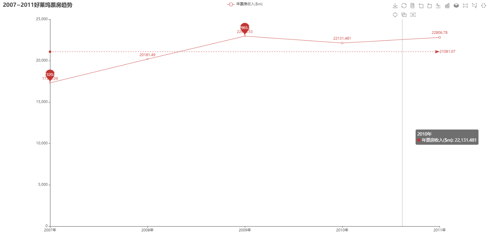

## This is my college courses in Python.
It includes two courses Visualization and Algorithm.

1. Algorithm Course is divided by tags,and all the solutions and datasets are implemented in Python.
2. Visualization Course is including many tests.

Tips : all the tests i will push after the tests have been finished , it is preventing the others from copying.

The Course has been finished!!!

### Display:
- The Algorithm Course are divied in some tags.

- The Visualization Course includes three tests and a last is the final test:

1. Test1 is some numpy using methods.
2. Test2 includes some tasks and following images are the display:

3. Test3 is a map operation it is the population flowing of Melbourne.

4. The Final Test is the WHPU's Admission Status.

# Summary:
After this term's two course have been finished I have learned more about Python and the Algorithm and a little web skills.
I wish I could use what I have learned this term to make more thing in the futrue!